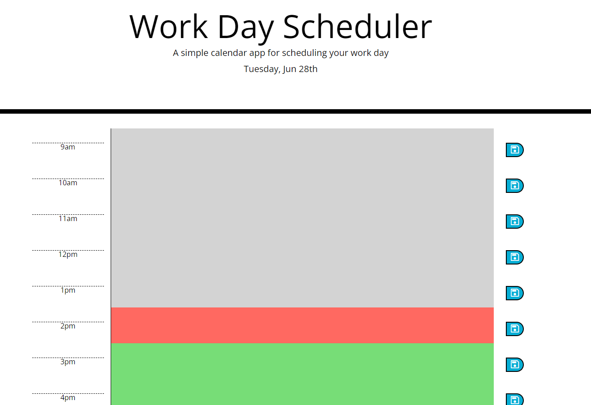

# Work Day Scheduler Starter Code 📅

The website will show you todays date and have time intervale of the day. Based on the color, you will know if the time has pasted (gray), you're in the current time (red), or the future time (green). You'll be able to write and thing you want and save the information. When you reload the information will still be there.

Come plan your day [here](https://esmy101.github.io/planning-my-day/). 💻

